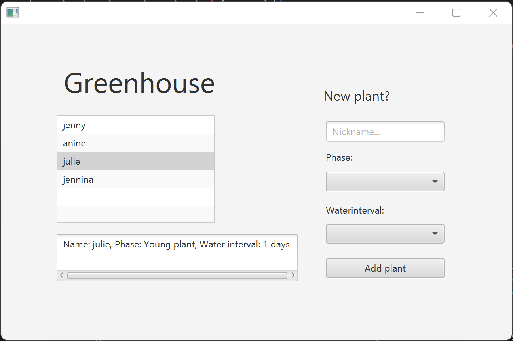
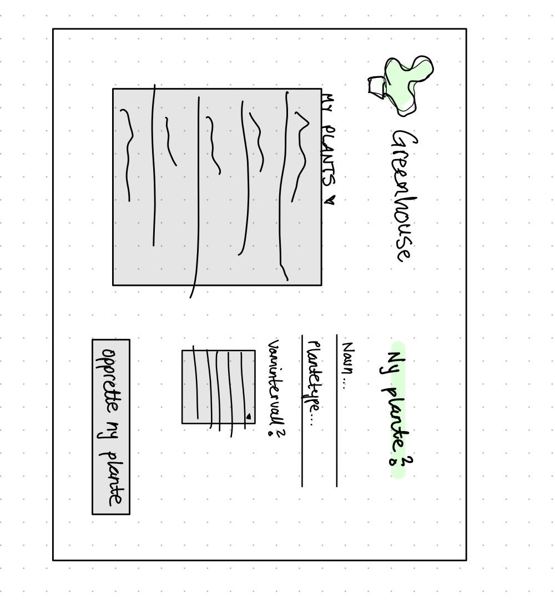

# Release 1

### **What is completed, and what did we not complete?**

As of now, we completed every function we wanted to - except from being able to filter the list of plant. We have already made a function in PlantOverview.java that should be able to filter based on a given predicate, which could be for example “Show all Grown Plants”, or “Show all plants with an water interval of 3 days”. The completed functions on the other hand, is that we can create/add plants to our greenhouse, with a basic overview of each plant. We can also click on a specific plant, and get more infomation about that plant. All data - meaning all information about each plant - is stored in a text file, and is used when we reopen the app, so that no plant is forgotten about.

 

### **Cooperating:**
The group has been good at cooperating and communicating. When working on the group clarification of expectations, we quickly, but thoroughly, came to an agreement. We haven't encountered many disagreements, primarily because we tend to prioritize collaboration and problem-solving over assertiveness.

While working on the first deliverable, we started getting an overview on the project and its demands. From there, we assigned different working areas of the projects demands. We all help eachother when needed, as well as giving updates on how it is going. When feeling overwhelmed or loosing the bigger picture on how the project is going, or what is left to do, we all talk togheter to get a better understanding on where we are in the process. We also have a Notion-page togheter for todos that are not as clear as issues in GitLab, but needs to be written down somewhere until they are completed. Cooperating has for the time-being worked out very well.
