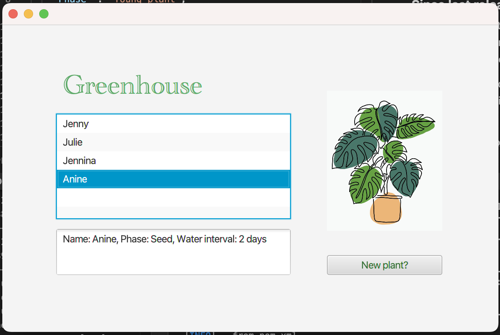
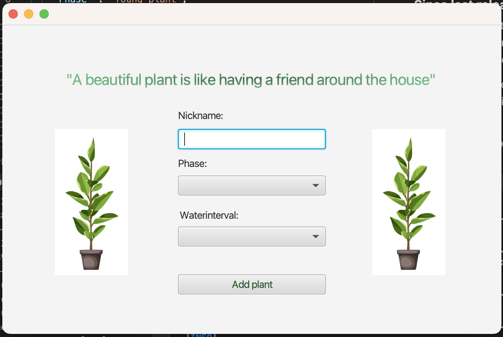
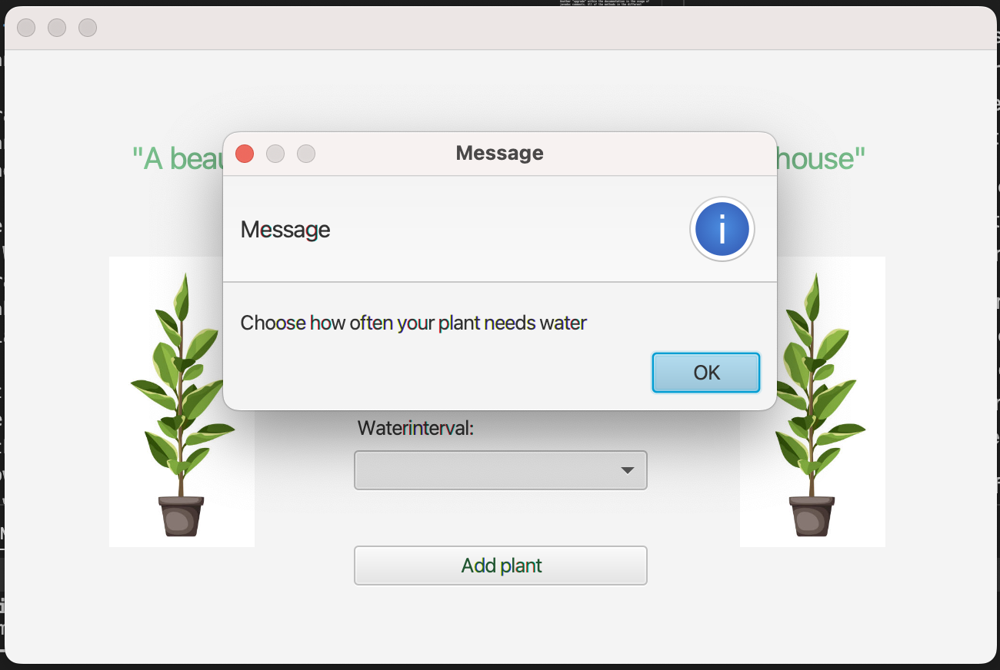

# Release 2

### **Since last release we have changed the following:**

We have upgraded the file format, so data is now stored using JSON and the Jackson library, and we no longer have the FileManagement class.

Now, we have two distinct pages for a more user-friendly experience. When the user clicks the "New plant?" button, they will transition to the new page, where the needed information about the plant can be added. Once the user has added the plant, they will return to the original page.

The application now has a much larger scale of exception handling. We have added pop-up alerts with messages explaining the problems. For instance, if the user does not choose a growing phase when adding a new plant, a pop-up saying that will appear.

In order to open the repository in Eclipse Che, a devfile.yaml has been added. There is a link at the top of the outmost README-file which leads the user directly to the repo in Eclipse Che. 

The documentation for release 2 has been updated with a PlantUML diagram describing the component architecture. Another "upgrade" within the documentation is the usage of javadoc comments. All of the methods in the different classes now have a javadoc explaining what the method does, as well as parameters and return value if there are any. 

Here are screenshots of the pages in the current application:

*What we want in the final product is explained in the outmost README (on the same level as greenhouse).*

 

### **Workflow and cooperating:**

In our project, we use a lot of GitLab's features to maintain an efficient workflow. As recommended, milestones are used to keep track of the different deliverables. 

Issues are used for tracking all of our tasks, and they are categorized by type, status and importance with labels. For every issue, we create dedicated branches. This allows us to work on different tasks simultaneously without conflicts. As our work progresses and new methods are implemented, we regularly commit changes to keep everything updated.

We try to perform regular merges to the 'main' branch upon completion of an issue. We use merge requests, which require approval by another group member, in order to improve code quality.

As for documentation, we are using several README files explaining what the different packages and folders contains. This makes it easier for both us in the group and others from the outside to understand the project structure.

When it comes to our collaboration and communication, we find it best working together, during established working hours. Being physically present helps us address issues and requests promptly. Working together helps us all stay motivated, and insures that everyone is contributing equally. 

Even though we also cooperated a lot while working with the first deliverable, we are now using liveshare in VS Code when working together on an issue. 

Incorporating these GitLab-based practices into our workflow has improved our project management, collaboration, and code quality. By maintaining clear task documentation, structured branches, regular merging, and open communication, we continue to work towards our project's success.

 

### **Code quality**

To ensure high code quality we use the tools jacoco, spotbugs and checkstyle. By collecting and presenting detailed information about test coverage, jacoco lets us know how much of the logic we actually are testing. 

Spotbugs searces the code for common coding errors, potential bugs, and other issues, and gives us the opportunity to discover problems that might not have occured yet. 

As for checkstyle, it helps us maintain a uniform and aesthetically pleasing codebase, which is not only easier to read but also minimizes the chances of errors caused by inconsistent coding styles.

