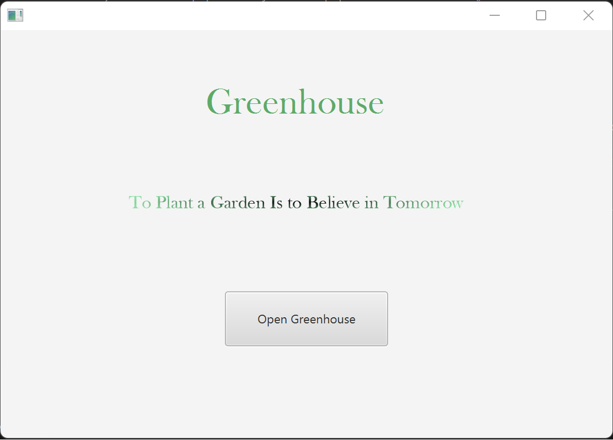
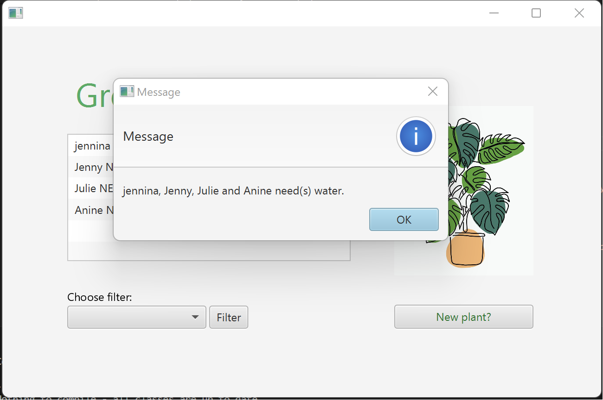
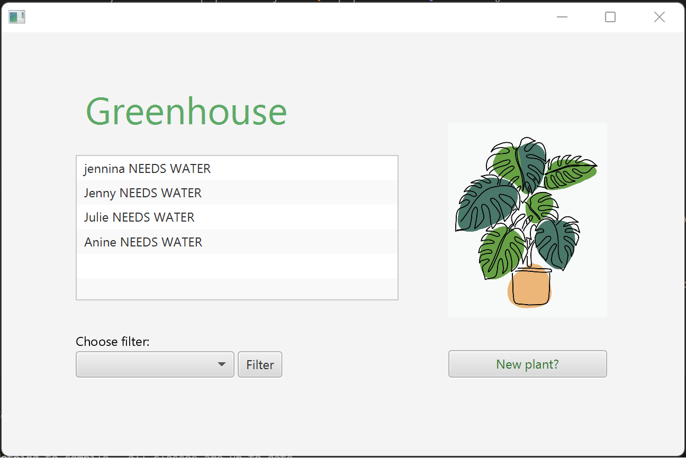
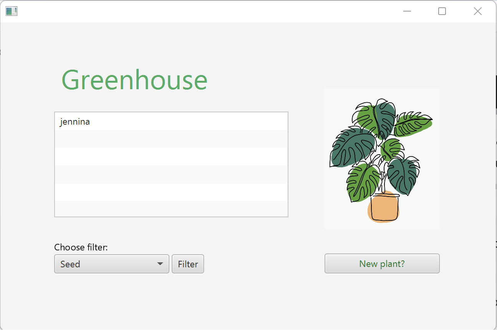
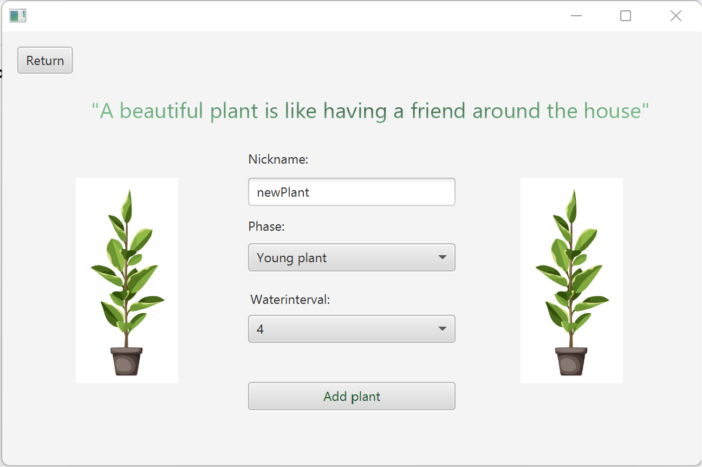
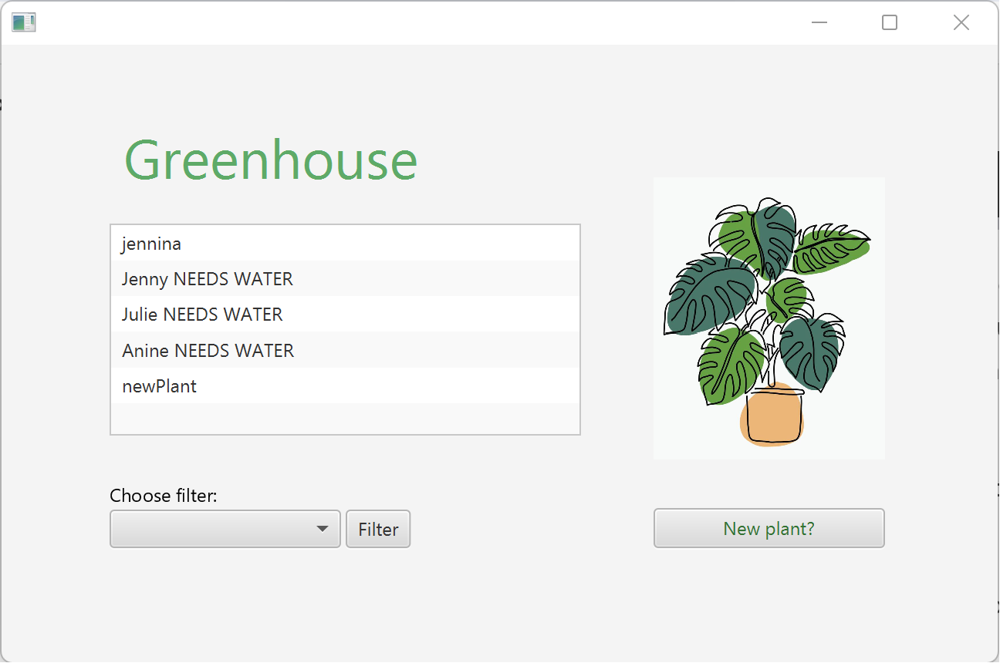
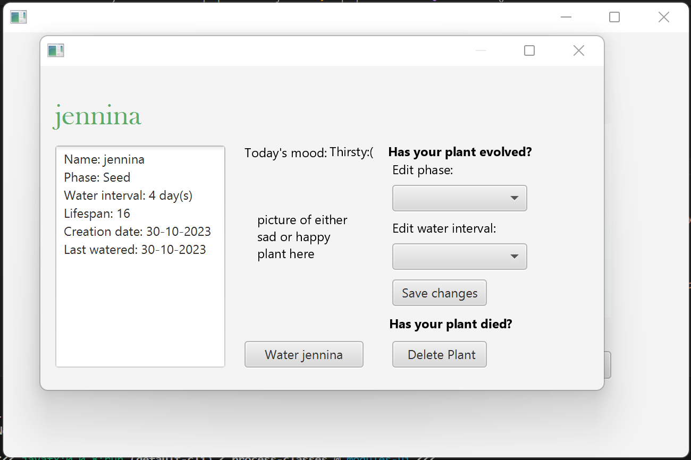
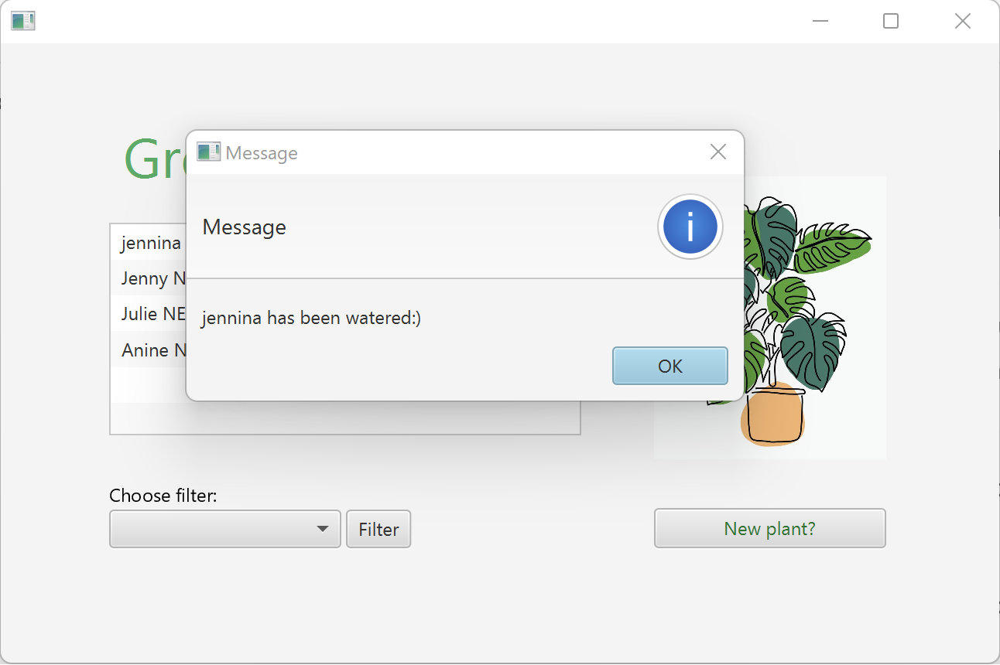

# Release 3

### **Since last release we have changed the following:**

For our last release, we present our shippable and final product. Throughout release 3, we have improved and added features as well as the overall functionality. We have ensured it to fit our user scenarios and improve the app's practical approach. 

This includes the possibility of knowing how long you have had the plant. We have incorporated a calendar system to keep track of what date each plant was added to the greenhouse. By implementing a calendar system, it has also become possible to provide the user with a reminder to water the plant after the plant's designated water interval has elapsed. 

Users can now edit their plants if there at some point was entered wrong information about it, or if it has evolved and behaves differently. A user can also remove a plant if the plant has died or is no longer wanted in the greenhouse.

To enhance the user experience, we developed the app by incorporating more pop-ups. For instance, when a user wants to create a new plant, this process takes place on a separate page. Pop-ups appear for example when a user needs to water their plant(s), and when error messages occur. In essence, the page is more organized and tidy, with an improved interface, also considering the visual aspects.

Furthermore, we also set up our Rest-API and a server connection. The app's backend is powered by Spring Boot. Our REST API helps with communication between the app's frontend and backend, allowing for seamless data exchange and interaction. With the REST API, one can perform a variety of operations, meaning creating, updating, deleting and retrieving data, all in a structured and standardized manner. This integration allows us to deliver a responsive and dynamic application that can adapt to future requirements. More information about our REST-API can be read here: [README.md](../../springboot/README.md).

Lastly we have made our app shippable using the JDK tools jlink and jpackage. Jlink and jpackage configurations are added to the [pom.xml](../../ui/pom.xml) in order to be able to generate an exe-file on Windows, dmg-file on macOS, or deb file on Linux that can be downloaded to the user's computer as they would install any other application. However, since the packaged app is based on the remote version of our application, you would have to run springboot in the background while using the packaged app. Also, if the user is running the app on Windows they would have to download Wix Toolset v3 or newer in order to run the jpackage commands. This is not necessary for Mac nor Linux users. After downloading Wix Tools (or not) do the following steps in order to run the app with jlink and jpackage:

1. Run `mvn clean install` from the root directory project to build the project and run tests. Use the same command but append `-DskipTests` in order to skip all tests.

2. Run `cd springboot` and then run `mvn spring-boot:run` to launch Spring Boot.

3. In a new terminal, run `cd ui`. Then run `mvn javafx:jlink` followed by `mvn jpackage:jpackage`. Jlink makes a .zip-file of the project, which jpackage then converts to a downloadable file in ui/target/dist, where the type of file depends on your operating system.

4. Open the file and install the application. On Mac the installation may happen automatically. Now you can open the application and use it as you would any other application. 

Here are screenshots of the pages in the current application:

**Front page:** We have added a front page, that welcomes the user to the application. The user also gets a pop-up saying which plants in the greenhouse need water

**Main page:** The main app page has gotten a new choice box for choosing the filter options to use on the list view on the page.

**New plant page:** The page for adding a new plant has implemented a return button.

**Pop-up page:** Clicking a plant's name in the list view of the main page opens a pop-up window, containing information about the plant, as well as the options to water, edit or delete the plant.

 

### **Workflow and cooperating:**

Cooperating has worked well from the start. All group members have communicated consistently, and there has mainly been agreement and a common understanding of the future app development, and how we wanted to document this. That being said, we have evolved our work habit regarding issues, commits, and merging. 

In the earlier releases, we made new issues where we saw fit, but did not use commits as frequent as preferred - mainly referring to release 1. The commits themselves are also more consistent, as of marking each commit with the issue's number at the end with (#number), which connects the commit to the relevant issue in GitLab. We also use labels to categorize each issue, with how the issue is prioritized, what type of change is going to be made, and the status of the issue. 

In addition to this, we used to merge our own branches into master using the terminal, after asking each group member in real life if there were any other member currently merging. This was both impractical, and not the least appeared confusing and unstructured in GitLab. We have since made progress, and create a merge request as we are making a new issue. We assign a member as a reviewer, and ensure each other by closely reading, and oftentimes by leaving a comment additionally. We have made sure to put more focus and time on code reviewing each others code by leaving constructive comments on each others work in gitlab, to ensure no major code issues are merged into the master branch. By code reviewing, we have a better understanding of what changes have been done in our app, and we can then confidently approve the merge request.

The group has utilized the opportunity to work remotely during this working period, as we haven't been able to physically meet at different times for various reasons. Live-sharing has therefore been of great assistance, not only when someone can't meet physically, but especially now that we primarily have been working in pairs - also called pair-programming. When pair-programming we have been consistent in adding our partner as a co-author in commit messages. There have also been times where we have started on a certain issue by ourselves, and during working on the issue have needed assistance and therefore switched over to pair-programming. In these cases we have made sure to switch reviewers of the code to someone who has not been working on it themselves, if the original reviewer ended up writing some of the code, to ensure that nothing is being overlooked.

Even when pair-programming we have had consistent group meetings with the other pair to inform each other what the other pair has been working on and/or what they are struggling with. 

 

### **Code quality**

To ensure good quality code we have made comprehensive tests for each of the project's modules. Testing is a critical phase in ensuring the robustness and reliability of an application. To test our application we have used junit and TestFX. JUnit is a widely-used testing framework for Java that facilitates the creation and execution of unit tests. It has allowed us to define test methods, assert expected outcomes, and manage test cases efficiently.

TestFX, on the other hand, is specifically designed for testing JavaFX applications. It provides a set of APIs for simulating user interactions with the graphical user interface components. This has allowed us for comprehensive testing of the application's frontend, ensuring that user interactions result in the expected behavior. The combination of using JUnit and TestFX has made us able to test the code in all our packages. 

To be sure that most functionality is tested in the application we have used the code coverage library JaCoCo. We originally strived to have nearly 100% test coverage. However, some code does not make sense to test, as it will only be reached when the actual app is running, not while testing. An example of this is in the method savePlantOverview in PlantPersistence as it saves to a given json file, that we do not want to save information to when testing, as it will overwrite our actual app data. In order to not overwrite our data, we have decided to not explicitly test this method, but as it uses an other method in the same class that is being tested, we concluded that we do not need 100% test coverage in this case. 

Unfortunately, we have not implemented the remote controller tests. We have tried different ways to be able to test these, but it has been difficult to find a solution. Time pressure means that we have had to step away from testing the remote controllers.

Jacoco reports can be generated by using the command `mvn test` and then found in the target/site

Reflecting back on how we have made tests we would in a possible future iteration be better at regularly making tests when we implement a new future in the app, in contrast to what we did during this process, which was implement all needed features in a class and then make tests for all methods in the class. This made the task of making test less fluid.

In addition to testing our code to ensure correctness we have also continued to use the development tool Checkstyle and the program SpotBugs to help us write better code. Both are integrated as plugins with Maven.

Checkstyle helps programmers write Java code that adheres to a coding standard. We have used the google checks configuration to make sure our code has consistent and easily readable code. Using checkstyle has been an important part of writing our code and we have made sure the code has no checkstyle errors in order to deliver an uncluttered code. We do however have some checkstyle warnings that we did not have time to fix.

SpotBugs uses static analysis to look for bugs in Java code. We have consistently checked our code with SpotBugs in order to make sure that there are no major errors in our code that may lead to inconsistent or unsafe code.

